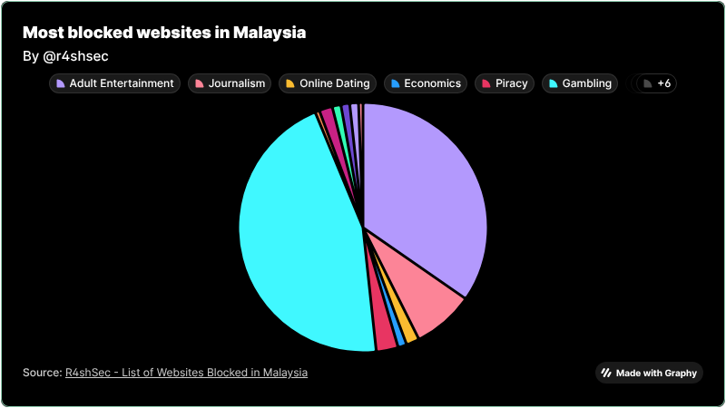

+++
date = '2026-03-19T20:47:05+08:00'
draft = false
title = 'Censorship in Malaysia — List of Websites Blocked Since 2026'
featured = true
showSummary = true
summaryLength = 200
description = "This blog explains how the Malaysian Communications and Multimedia Commission (MCMC) restrict websites and the list of websites blocked in Malaysia in 2026."
summary = "This blog explains how the Malaysian Communications and Multimedia Commission (MCMC) restrict websites and the list of websites blocked in Malaysia in 2026."
tags = ["mcmc","censorship","malaysia","media","politics","freedom","press freedom", "blocklist"]
categories = ["Free Speech"]
+++

## How does Malaysia block websites?

Malaysian Internet Service Providers (ISPs) have mandatory compliance with the Malaysian Communications and Multimedia Commission (MCMC) to implement Domain Name Server (DNS) blocking. Tech-savvy Malaysians could check via doing an `nslookup` where it would redirect to a server (`175.139.142.25`).

## List of Websites Blocked

I tested a handful of websites with various categories. I also published my findings to my [GitHub Gist](https://gist.github.com/r4shsec/3a7bfc580bc592486d4512a086c3e22e). You can visualize the chart [here](https://visualize.graphy.app/view/0ee98a44-d3ed-4d83-ba18-4759603c5699).

- 45.45% — Gambling
- 34.66% — Adult Themed
- 7.95% — News

## Circumvention

You can bypass the Internet Service Provider (ISP) censorship via a third-party Domain Name Server (DNS) provider. 

- [Cloudflare DNS](https://www.cloudflare.com/learning/dns/what-is-1.1.1.1/) (`1.1.1.1`)
- [Google DNS](https://developers.google.com/speed/public-dns) (`8.8.8.8`)
- [OpenDNS](https://www.opendns.com/) (`208.67.222.222`)
- [AdguardDNS](https://adguard-dns.io/en/public-dns.html) (`94.140.14.14`)

### Family

If you're concerned that your child may access unsafe websites, most third-party Domain Name Server (DNS) providers have a family plan where unsafe websites are blocked.

- [Cloudflare Family Plan](https://blog.cloudflare.com/introducing-1-1-1-1-for-families/) (`1.1.1.3`)
- [AdguardDNS Family Plan](https://adguard-dns.io/en/public-dns.html) (`94.140.14.15`)
- [OpenDNS Family](https://www.opendns.com/setupguide/#familyshield) (`208.67.222.123`)