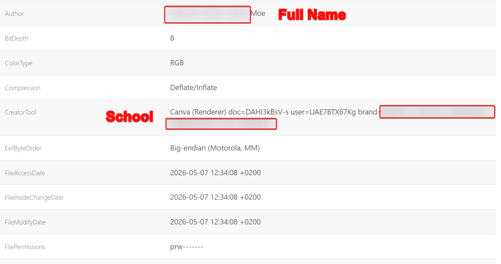
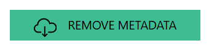

+++
date = '2026-05-07T18:11:23+08:00'
draft = false
title = 'How Discord and Canva May Doxx You!'
featured = true
showSummary = true
summaryLength = 200
description = "This blog post demonstrates how metadata retained by Discord after making images in Canva might be used to leak your personal information and how to prevent it."
summary = "This blog post demonstrates how metadata retained by Discord after making images in Canva might be used to leak your personal information and how to prevent it."
tags = ["discord","canva","dox","doxx","metadata","opsec","exif","metadata","operational security"]
categories = []
+++

Discord is a popular messaging application used by millions of users for chatting. Canva, on the other hand, is a popular online graphic design tool. Many Discord server owners use Canva when making images such as their welcome banner.

However, did you know that this may potentially lead to your personal information being leaked?

## What is metadata?

Exchangeable Image File Format (EXIF) metadata, in simple terms, refers to the information in an image. As an example, the location where the image is taken or the editing software used. Canva retains similar metadata.

## Why is Canva important?

As I've explained above, Canva is used by a lot of Discord server owners when creating an asset such as their Discord server banner. 

Canva retains personal information accessible online such as the following:

- Your Account Name (full name if it's an Edu account)
- Organization (sometimes.. your school)
- Creation Date

Yes, you heard me right! When we use an [online EXIF viewer tool](https://jimpl.com/), we can see that Canva actually retains a lot of metadata that Discord doesn't strip away.

This is important as not many individuals would like their full name to be known to other strangers on the internet.

## How to Prevent This

You could prevent this by uploading your image to [Jimpl](https://jimpl.com/) and stripping the EXIF metadata away. 

Upload image > Remove Metadata > Save

