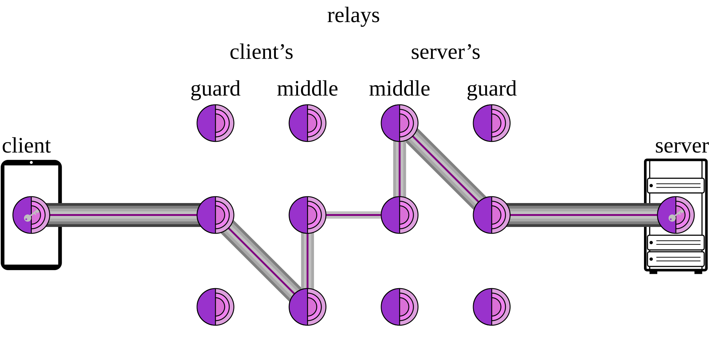
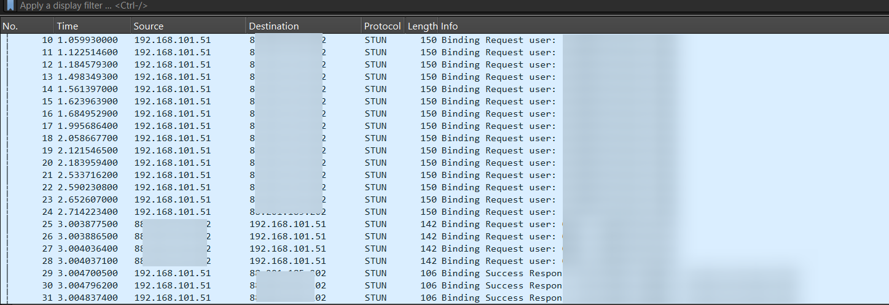
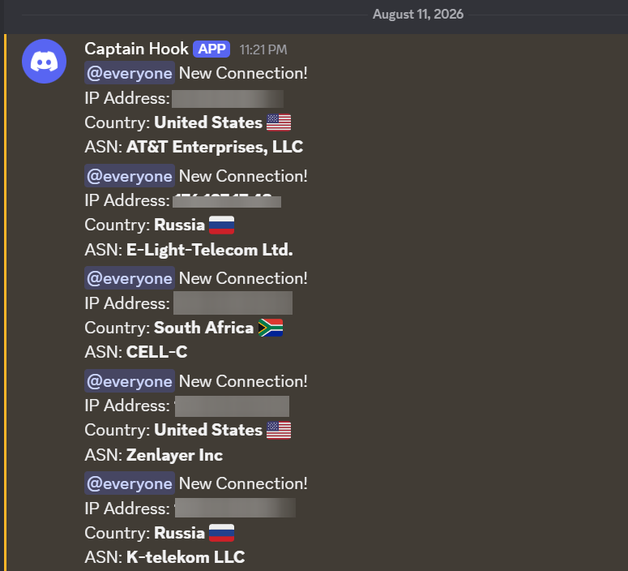

+++
date = '2026-08-11T14:41:55+08:00'
draft = false
title = 'How Connecting To Snowflake May Deanonymize You.'
featured = true
showSummary = true
summaryLength = 200
description = "This blog post covers the privacy risks when connecting to the Tor network via a Snowflake bridge."
summary = "This blog post covers the privacy risks when connecting to the Tor network via a Snowflake bridge."
tags = ["tor","tor browser","tor relay","tor snowflake","snowflake","deanonymization"]
categories = ["privacy"]
+++

Hey everyone :wave:

I've created a repository on GitHub (**Poisoned Snowflake**) regarding the privacy risks when using a Snowflake bridge to connect to Tor.



---

## What is Onion Routing & Snowflake?

Unlike normal everyday browsing, onion routing routes your traffic through 3 different relays before reaching the destination website:

1. Entry guard
2. Middle relay
3. Exit relay



This gives Tor its anonymity, allowing everyday Tor users to have extra privacy. 

Tor itself **isn't inherently illegal**. It's just the way it's used. Tor is used by journalists, activists, and whistleblowers.

Many oppressive countries, such as China and Russia, use Deep Packet Inspection (DPI) to block Tor traffic. Hence, the Tor Project created [**Snowflake**](https://snowflake.torproject.org/). Snowflake is used to disguise a user connecting to the Tor network by making it seem it's a normal **video call**.

Snowflake is much harder to circumvent, but it also comes with its own **privacy risks**.

## The Issue with Snowflake

To allow Snowflake to work, it uses [Session Traversal Utilities for NAT (STUN)](https://en.wikipedia.org/wiki/STUN) and [Interactive Connectivity Establishment (ICE)](https://en.wikipedia.org/wiki/Interactive_Connectivity_Establishment). This is essential to allow Snowflake to disguise itself as traffic similar to a video call.

During the ICE handshake when a `Username` is initialized, the operator behind the Snowflake proxy is able to fetch the IP addresses (including STUN servers) of Tor users using their proxy to connect to Tor.

If you're running a Snowflake proxy, you could use the following Wireshark filters:

```
ip.addr==[your local IP here] && stun
```



- The length of a packet when a connection is established with an individual is 108.
- When an ICE handshake is initialized, the Username could be found via regex patterns `(^[A-Za-z0-9+/]+:[A-Za-z0-9+/]+$)` in the packets.

A Snowflake operator could also create scripts which could then be used to filter the packets and capture the IP addresses of individuals connecting to their proxy as demonstrated above.



Since Snowflake is relatively low effort compared to running Tor relays, in a hypothetical scenario; state-backed threat actors with a lot of resources could spin up hundreds or thousands of Snowflake proxies in an attempt to deanonymize users connecting to the Tor network via malicious Snowflake proxies.

### Information Harvested

This is the following information that could be collected by a malicious Snowflake proxy:

1. The IP address of a user connecting to the Snowflake proxy.
2. The time when the connection was established.
3. The time when the connection ended. 

The real question is: Is Tor Broken? — **No.** This is precisely how Snowflake should work by design. I understand that critics may argue that a malicious Snowflake operator is unable to see the destination websites they're visiting. That is indeed true. However, it's highly risky for journalists, whistleblowers, and activists in countries such as China, Russia, Iran, and more.

### Interesting Discoveries

In June, 2026 when I was first building this script to show to my friends, I've noticed a few anomalous traffic during the webRTC ICE handshake when running a Snowflake Relay coming from US Department of Defense (DoD) and the UK Ministry of Defense (MoD) IP ranges.



IP ranges for the US DoD and UK MoD:

```
7.0.0.0/8
11.0.0.0/8
21.0.0.0/8
22.0.0.0/8
26.0.0.0/8
28.0.0.0/8
29.0.0.0/8
30.0.0.0/8
25.0.0.0/8
```

I'm currently unsure and quite confused about these anomalous connections coming from both government agencies. For any corrections about my blog and to clean the confusion up, you could send it to [r4shsec@protonmail.com](mailto:r4shsec@protonmail.com).

## Alternatives

I suggest using these bridges as an alternative to Snowflake:

- meek (the overall best) ⭐
- webtunnel (still could be blocked by DPI but makes traffic seem like normal HTTPS traffic)