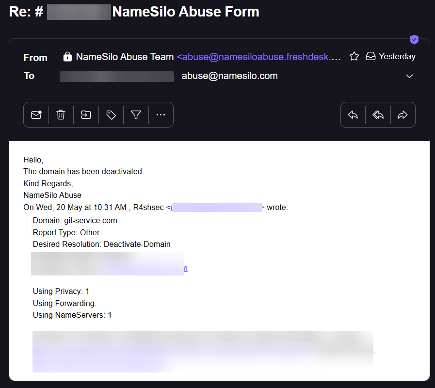
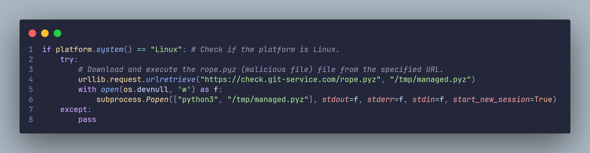
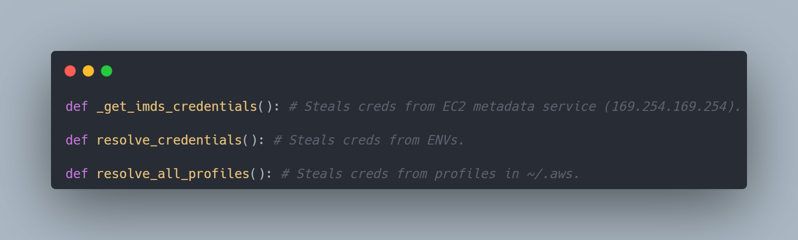
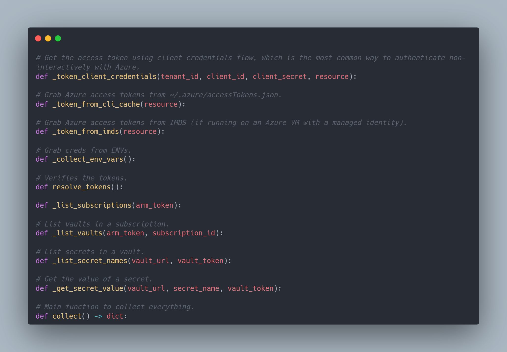
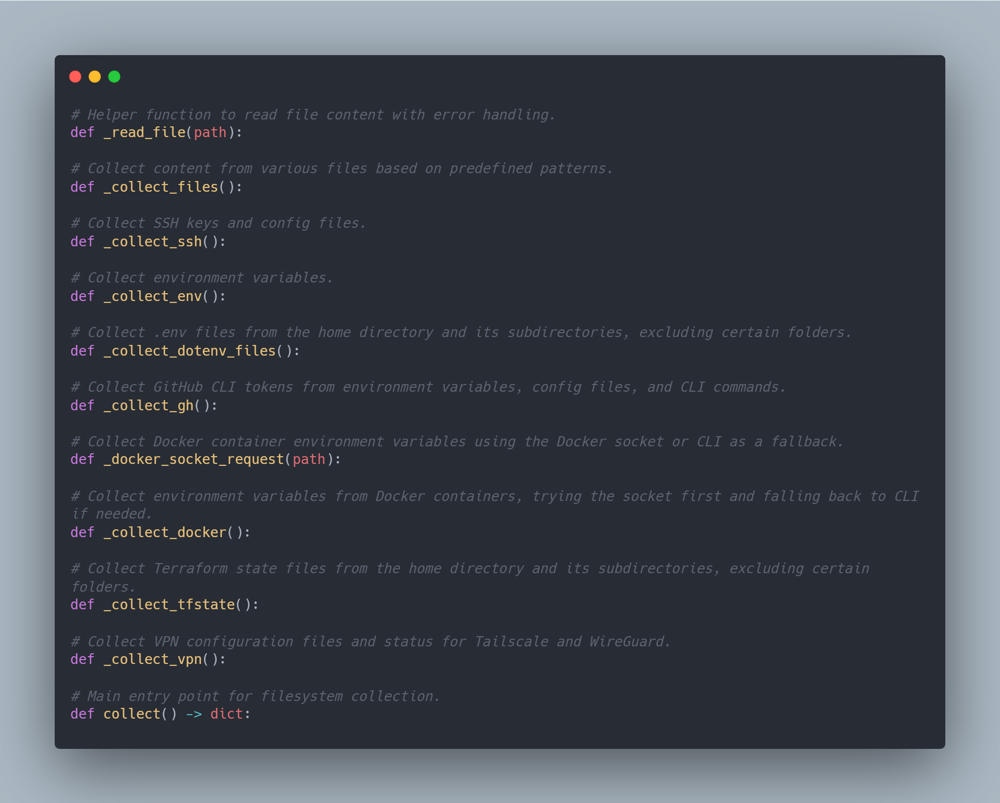
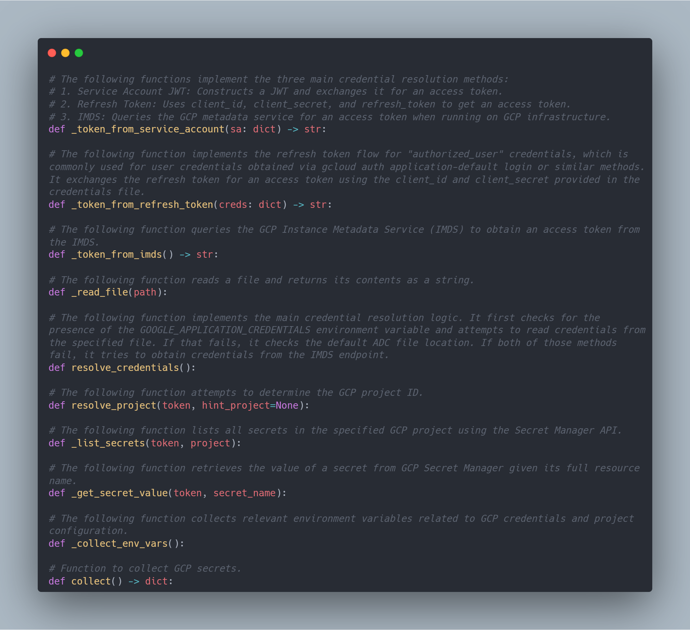
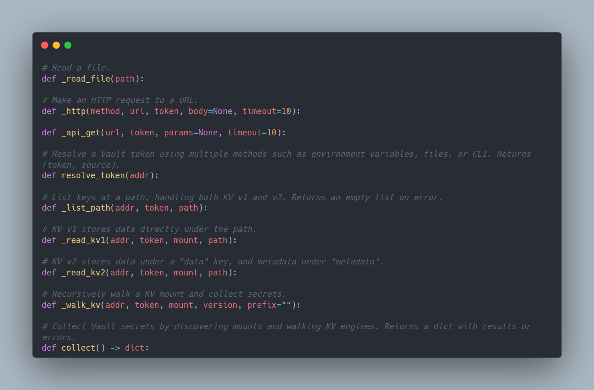

+++
date = '2026-05-20T21:21:56+08:00'
draft = false
title = 'Reverse Engineering The Mini Shai-Hulud Worm & Defense (Part 2)'
featured = true
showSummary = true
summaryLength = 200
description = "This blog provides details regarding the second variant of the Mini Shai-Hulud Worm after a cybersecurity researcher, @r4shsec, reverse engineered the compromised package, durabletask==1.4.1."
summary = "This blog provides details regarding the second variant of the Mini Shai-Hulud Worm after a cybersecurity researcher, @r4shsec, reverse engineered the compromised package, durabletask==1.4.1."
tags = ["Mini Shai-Hulud","Worm","Mini Shai-Hulud Worm","TeamPCP","Microsoft","supply chain attack","durabletask==1.4.1","python","python3"]
categories = ["reverse engineering"]
+++

Hello :wave:

This is a follow-up from my previous blog post regarding the Mini Shai-Hulud worm. As alleged by [Aikido](https://www.aikido.dev/blog/durabletask-package-compromised-mini-shai-hulud), the PyPI packages for `durabletask==1.4.1`, `durabletask==1.4.2`, and `durabletask==1.4.3` have been quarantined and yanked from PyPI as it has been compromised.

I'll also publish the files here to make it easier for security researchers to understand how these attacks work.

> [!NOTE]
> THE FILES HERE ARE ONLY USED FOR RESEARCH PURPOSES, AS IT BENEFITS THE SECURITY COMMUNITY. THE AUTHOR ISN'T RESPONSIBLE FOR ANY MISUSE. DOWNLOAD AND RUN WITH CAUTION.
> - [durabletask-1.4.1.zip](assets/durabletask-1.4.1.zip)
> - [rope.pyz (.zip format)](assets/rope.zip)

Without further ado, let's dive straight in!

## Downloading The Malicious Payload

In every supply chain attack affecting PyPI packages, Mini Shai-Hulud would always download a malicious Python Zip Application (`.pyz`) to `/tmp` in the `__init__.py` file. The rest of the contents of the file seem fine.

This worm only targets Linux machines so far.

It also downloads the malicious file from the domain, `git-service.com` which is not associated with GitHub. The domain has since been taken down after my abuse report.





## Infostealer (Malicious Payload)

The new variant contains way less files from the [previous variant](posts/mistral_worm_reverse_engineering/). No funny business like [playing roulette with Iranian and Israeli systems](/posts/mistral_worm_reverse_engineering/#4-check-the-timezone-and-locale).

```bash
total 84
drwxrwxrwx 1 r4shsec r4shsec  4096 May 16 01:31 .
drwxrwxrwx 1 r4shsec r4shsec  4096 May 21 14:02 ..
-rwxrwxrwx 1 r4shsec r4shsec     0 May 16 01:31 __init__.py
-rwxrwxrwx 1 r4shsec r4shsec  9101 May 16 01:31 aws.py
-rwxrwxrwx 1 r4shsec r4shsec  7803 May 16 01:31 azure.py
-rwxrwxrwx 1 r4shsec r4shsec 10499 May 16 01:31 filesystem.py
-rwxrwxrwx 1 r4shsec r4shsec  6370 May 16 01:31 gcp.py
-rwxrwxrwx 1 r4shsec r4shsec 16124 May 16 01:31 kubernetes.py
-rwxrwxrwx 1 r4shsec r4shsec  7969 May 16 01:31 passwords.py
-rwxrwxrwx 1 r4shsec r4shsec  9301 May 16 01:31 propagate.py
-rwxrwxrwx 1 r4shsec r4shsec  4224 May 16 01:31 vault.py
```

### Steal AWS Credentials.

The `aws.py` file contains a credential stealer that would steal AWS credentials from environment variables (ENVs) such as `AWS_SECRET_ACCESS_KEY`, `AWS_ACCESS_KEY_ID` and `AWS_SESSION_TOKEN`, from profiles such as ``~/.aws/credentials`` and ``~/.aws/config``, or from the EC2 Instance Metadata Service (``169.254.169.254``). It would also scan a list of AWS regions, enumerate all reachable EC2 instances via SSM, and dump every SSM parameter and Secrets Manager secret.



### Steal Azure Credentials.

The `azure.py` file contains a malicious payload to steal Azure access tokens.

1. Grab Azure access tokens from file path: `~/.azure/accessTokens.json`

2. Grab Environment Variables (ENVs):

- `AZURE_CLIENT_ID`
- `AZURE_CLIENT_SECRET`
- `AZURE_TENANT_ID`
- `AZURE_CLIENT_CERTIFICATE_PATH`
- `AZURE_SUBSCRIPTION_ID`

3. Grab Azure access tokens from IMDS (`169.254.169.254`).

4. Enumerate all accessible subscriptions and Key Vaults, dumping every secret value in plaintext.



### Grab Credentials From File Paths.

This is similar to the [credential stealer in the other variant.](/posts/mistral_worm_reverse_engineering/#credential-stealers) This collect config files from ~95 file paths, GitHub CLI tokens, SSH keys, & etc.



### Steal Google Cloud Platform (GCP) credentials.

The `gcp.py` contains an infostealer that would steal GCP credentials from environment variables (ENVs) such as `GOOGLE_APPLICATION_CREDENTIALS`, file paths such as `~/.config/gcloud/application_default_credentials.json`, and the GCP IMDS endpoint. It then enumerates and dumps every secret in GCP Secret Manager in plaintext.



### Steal Kubernetes Credentials.

The `kubernetes.py` file contains a payload to collect all Kubernetes data such as from the `~/.kube/config` file, environment variables (ENVs) such as `KUBECONFIG`, and etc.

### Steal HashiCorp Vault.

The `vault.py` file contains a payload that would attempt to steal all HashiCorp Vault credentials. It would attempt to fetch environment variables (ENVs) such as `VAULT_TOKEN`, `VAULT_ROLE_ID`, and `VAULT_SECRET_ID`, fetch file paths such as `~/.vault-token` and attempt to fetch client tokens.



### Steal Passwords.

The `passwords.py` file contains a malicious payload that targets 4 password managers such as Bitwarden, 1Password, pass (GPG-based Unix password manager) and gopass. It scans for environment variables (ENVs) such as `PASS`, `PASSWORD`, `SECRET`, `KEY`, `BW_*`, and `OP_*`. It also scrapes file paths such as `~/.bash_history` and `~/.zsh_history` for the master passwords previously typed in the terminal.

---

*(Note: I've noticed that some files might be missing and the domain used to download them is currently down. I'll update if there's any new resources.)*

## Defense

1. Uninstall any affected PyPI packages (`durabletask==1.4.1`,`durabletask==1.4.2`, and `durabletask==1.4.3`).
2. Install the unaffected package, `durabletask==1.4.0`.
3. Rotate any credentials that might be affected.